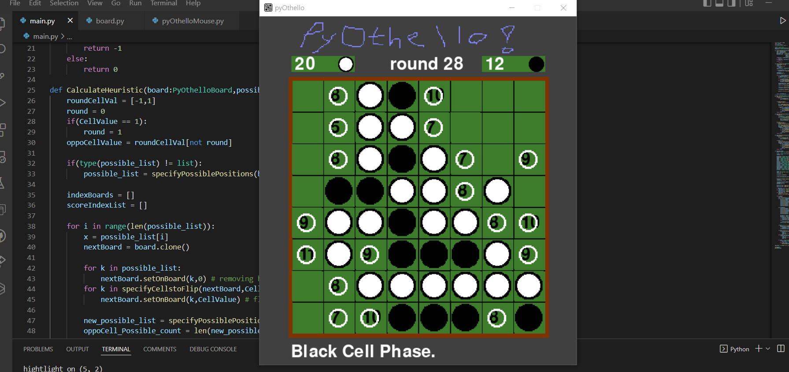

# PyOthello Game Project for Term project
made by 2022104240 전자공학과 박기호 SWCON104-00

시연영상 : PyOthello 텀프로젝트 시연영상.mp4

# 1) 주제 선정 이유
- 텀프로젝트 데이터분석을 대체하는 프로젝트로 인공지능 Othello 게임기를 만들어 보려고 합니다. 타수업 중 인공지능에 대해 학습하는 수업이 있는데 이 강의에서 배웠던 휴리스틱 평가함수, 그리고 앞으로 배울 신경망 학습을 실제로 구현해보고 싶어 Othello 게임기를 계획하게 되었습니다!

# 2) 가설 정의(게임의 목표)

### 게임 계획 및 구조도 및 일정
#### 이 게임의 기능
  1. 오셀로 게임 규칙을 수행하는 기능
  2. 인공지능의 기능 중 하나인 휴리스틱 평가 함수를 활용한 AI를 적용하는 것
  3. 신경망(Neural Network)를 활용한 AI를 적용하는 것
  4. 인공지능의 성능을 평가하는 기능입니다.

#### 구현사항
  1. pygame 기반으로 하는 윈도우 폼 게임을 개발한다,
  2. 사용자의 마우스 클릭 동작으로 돌을 놓을 수 있다.
  3. 오셀로 규칙에 맞게 돌을 놓을 수 있는 위치를 제한한다. 또한 게임이 끝났는지 여부를 알고, 점수를 판독할 수 있는 기능을 구현한다.
  4. 인공지능을 도입한다. - 휴리스틱 평가함수를 이용해 3수 정도 범위에서 승률이 가장 높은 돌에 놓는 기능을 구현한다.
  5. 신경망을 이용해 오셀로 게임을 기계학습한다. - 구현이 어려울 시 이 사항은 못할 수도 있다.

세부 일정
1. (04/21) pygame로 기본적인 화면과 이미지를 렌더링한다.(배경 게임판, 돌) 
2. (04/21) pygame로 마우스 입력을 받는다. 8x8 게임판에 돌을 넣는 기능을 구현한다. 이때 보드판을 2차원 리스트화하고 돌을 중복으로 넣을 수 없게 한다. 
    2-1.(04/21) 마우스 포인터 주소를 받고 게임판 위치를 얻자. 
    2-2.(04/21) 돌을 놓아 보자. 
    2-3.(04/21) 윈도우 크기를 배율할 것 
    2-4.(04/21) 윈보드를 2차원 리스트화하는 작업 + 리스트 데이터를 기반으로 화면에 출력하는 방식 
3. (05/10) 오셀로 게임에서 턴을 진행하려면 반드시 상대 돌을 감싸는 곳만 넣을 수 있다는 규칙을 적용한다. (둘 수 있는 돌의 위치를 파악해서 표시한다.) 
    3-1.(05/04) main loop에 구현된 보드 업데이트 처리부를 함수화한다. 
    3-2.(05/10) 보드판의 흰돌과 검은돌의 차례를 차례함수로 만들고 마우스 클릭에 따라 돌을 놓는 함수를 차례함수 안에 구현한다. 
    3-3.(05/10) 마우스 클릭 이벤트 처리함수를 함수화하고, 전역변수의 형태로 마우스 입력에 접근할 수 있도록 한다. 
    3-4.(05/10) 차례함수에서 돌을 놓을 때 놓을 수 있는 경우를 검사해서 놓을 수 있는 곳에만 놓도록 한다. 
4. (05/16) 게임이 끝날 조건을 검사하고, 게임이 끝날 시 점수를 판정해서 보여준다. 
    4-1.(05/12) 글자 및 숫자 텍스쳐를 활용해본다. 
    4-2.(05/16) 게임판의 구성요소를 출력한다. (실시간 점수 및 현재차례) 
    4-3.(05/16) 게임이 끝날 조건을 검사하고 게임이 끝나면 메시지를 띄운다. 둘 수 있는 곳이 없을때를 종료시점으로 한다. 
5. (05/24) 간단한 인공지능을 도입한다.(기계가 판단하고 둘 수 있는 모듈을 만든다.) 
    5-1.(05/24) 둘 수 있는 선택지 중 무조건 첫번째 선택지를 고르는 알고리즘을 구현한다. 
    5-2.(05/24) 1대1 플레이 및 인공지능대 사람 플레이, 인공지능 대 인공지능 플레이 세가지 모드로 게임을 돌릴 수 있게 한다. 
6. (06/05) 휴리스틱 평가 함수를 구현하고 휴리스틱 평가함수를 적용하는 AI를 완성한다. 
    6-1.(05/31) 휴리스틱 평가 함수를 구현한다. 
    6-2.(06/05) 미니맥스 방법에 적용해서 3수 이후를 내다보고 좋은 위치를 판단하는 함수를 구현한다. 
    6.3.(06/05) 휴리스틱 평가 함수를 활용한 돌 위치 판단함수를 만든다. 

# 6) 결론 : 3수 너머의 상황을 반영하는 AI가 1수만을 분석하는 AI보다 더 승률이 높다.
1수를 바라보는 AI와 3수를 반영하는 AI중 어느 것이 승률이 높은지 확인해본다. 
 
측정을 위해 Gamemode 2(AI vs AI) 모드로 대전을 진행해보았다. 
먼저 시작하는 것에 대한 영향을 고려해 흰돌 검은돌 순서도 바꾸어서 해 보았다. 
 
``game_HeuristicAI_turn`` : 한 수를 반영하는 돌 위치 배치 함수 
``game_HeuristicMinimaxAI_turn`` : 세 수를 반영하는 돌 위치 배치 함수 
 
 
``game_HeuristicMinimaxAI_turn`` 흑 : 백 ``game_HeuristicAI_turn`` 
1판 <b>32</b>:30 
2판 <b>61</b>:03 
3판 <b>49</b>:15 
4판 <b>51</b>:13 
5판 <b>48</b>:16 
6판 <b>41</b>:23 
7판 <b>46</b>:18 
8판 <b>50</b>:14 
승률이 100%에 수렴하는 것을 확인할 수 있다. 
 
한 수 앞을 측정하는 AI를 먼저 하게 한다. 
``game_HeuristicAI_turn`` 흑 : 백 ``game_HeuristicMinimaxAI_turn`` 
01판 <b>47</b>:17 
02판 07:<b>57</b> 
03판 14:<b>50</b> 
04판 <b>48</b>:16 
05판 01:<b>63</b> 
06판 <b>37</b>:27 
07판 24:<b>40</b> 
08판 30:<b>34</b> 
09판 05:<b>58</b> 
10판 18:<b>45</b> 
11판 06:<b>58</b> 
12판 13:<b>51</b> 
승률 약 75%으로 3수 앞을 내다보는 것이 더 승률이 높음을 알 수 있다. 
  